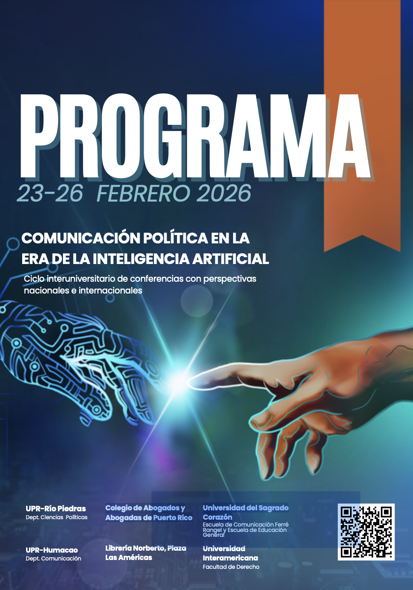

# Índice

## Sobre el Evento

- [Introducción y Bienvenida](#introducción-y-bienvenida)
- [Agradecimientos](#agradecimientos)
- [Comité Organizador](#comité-organizador)

## Programa por Día

### [Lunes 23 de febrero](/lunes-23)
- **Mañana:** UPR-Río Piedras
  - [Palabras de bienvenida - Dra. Mayra Vélez Serrano](/lunes-23)
  - Conferencia Magistral: Dr. Martín Echeverría
- **Noche:** Colegio de Abogados y Abogadas
  - Panel: Aspectos legales y éticos de la IA

### [Martes 24 de febrero](/martes-24)
- **Día:** Universidad del Sagrado Corazón
  - Presentaciones de investigación
  - Sesión de posters estudiantiles
- **Noche:** Librería Norberto, Plaza Las Américas
  - Conversatorio y presentación de libros

### [Miércoles 25 de febrero](/miercoles-25)
- **Mañana:** UPR-Río Piedras
  - Presentaciones de investigación
- **Tarde:** Facultad de Derecho, UIA-Hato Rey
  - Panel multidisciplinario

### [Jueves 26 de febrero](/jueves-26)
- **UPR-Humacao**
  - Presentaciones finales
  - Clausura del ciclo

## Recursos Académicos

- [Resúmenes de presentaciones](/resumenes) - Abstracts de todas las conferencias
- [Semblanzas de participantes](/semblanzas) - Biografías de ponentes y panelistas
- [Recursos bibliográficos](/recursos) - Material de referencia y enlaces

---

# Introducción y Bienvenida

Este ciclo de conferencias sobre comunicación política en la era de la
Inteligencia Artificial (IA), con perspectivas nacionales e
internacionales es el primer evento en Puerto Rico dedicado a este tema
tan importante.

Surge de los comités organizadores y de todas las personas que han
apoyado y aceptado ser parte de estas conferencias porque reconocen que
la IA se ha incorporado en múltiples sectores de la sociedad. Esto
abarca la comunicación política por la cual producen y diseminan todo
tipo de mensajes encaminados a influir la opinión pública para apoyar o
para luchar en contra de ideologías, partidos políticos, sus candidatos
y los gobiernos de turno, entre otros.

Sin lugar a dudas, la IA ya es mecanismo integral en gran parte de la
producción y distribución de todo tipo de mensajes constructivos, pero
también destructivos como suele ser la propaganda, noticias falsas,
memes, *bots, trolls, deep fakes*, videos y múltiples otros contenidos
impresos y audiovisuales.

Durante los cuatro días de las conferencias, los participantes ofrecerán
investigaciones, reflexiones y testimonios con nuevas miradas al campo
de la comunicación política. Ponentes destacados de Puerto Rico, México,
Barcelona, República Dominicana y Estados Unidos expondrán
investigaciones y análisis que ayudarán a entender cómo la comunicación
política en esta nueva era está afectando el presente y futuro de las
democracias cada día más frágiles.

Una de las metas principales de estas conferencias es fomentar la
educación, la investigación y la colaboración multisectorial en este
campo del saber tan rezagado en Puerto Rico. También confiamos ayudar en
el desarrollo de estándares éticos, mejores prácticas académicas y
profesionales y además directrices que protejan la integridad de la
comunicación pública y política. En fin, estas conferencias son una
modalidad de capacitación de lectura crítica de los medios (tipo *media
literacy*), pero en torno a comunicación política con marco de
referencia de la IA.

Para complementar esas metas, se está estableciendo un sitio de Internet
con recursos bibliográficos, lecturas, enlaces y además con grabaciones
de algunas de las presentaciones. Esté atento a avisos de enlaces al
respecto.

Gracias por participar con nosotros ya sea presencialmente o
virtualmente. Confiamos que este ciclo no sea el último sobre este tema.
Para el próximo, necesitaremos contar con su interés y participación.

## Comité Organizador

Federico Subervi Vélez (<subervif@gmail.com>)

Maximiliano Dueñas Guzmán

Joselyn Ponce Barnés

Iván Cardona, Jr.

# Agradecimientos

El comité organizador reconoce y extiende sus sinceros agradecimientos a
cada una de las siguientes personas que de una forma u otra
contribuyeron a hacer posible este ciclo de conferencias.

-   Dra. Mayra Vélez Serrano, Directora del Departamento de Ciencia
    Política, UPR-RP

-   Libia M. González López, Directora del Centro de Investigaciones
    Sociales, UPR-Río Piedras

-   Ovidio Torres, Especialista de Tecnología, Facultad de Sociales,
    UPR-RP

-   Dra. Mirelsa Modestti González

-   Dr. Ángel Israel Rivera Ortiz (retirado) y Dr. Jaime Lluch,
    Departamento de Ciencia Política, UPR-RP

- A la Dra. María Vera Hernández, la profesora Sandra Pedraza, al Dr.
Luis Cintrón Gutiérrez, Dr. Ojel Rodríguez Burgos y demás miembros del
comité organizador de la Escuela de Comunicación Ferré Rangel y la
Escuela de Educación General de la Universidad de Sagrado Corazón

- Licenciados Daniel Nina y Miguel Marrero, Colegio de Abogados y
Abogadas de Puerto Rico

- Lcdo. Julio Fontanet Maldonado, Decano de la Facultad de Derecho, y
Zaida Nieves, Asistente Ejecutiva, Oficina del Decano,
Universidad Interamericana

-   Migdalia Alvarado y Javier González, Librería Norberto

- Dra. Ivette Irizarry Santiago, Dr. Héctor Rafael Piñero Cádiz, y Dra.
Marcia Pacheco García, UPR-Humacao

¡Muchísimas gracias a todos y todas!

## Palabras de bienvenida de la Dra. Mayra Vélez Serrano

**Directora del Departamento de Ciencia Política**

### Universidad de Puerto Rico, Recinto de Río Piedras

Es un honor darles la bienvenida, como directora del Departamento de
Ciencia Política de la Universidad de Puerto Rico, Recinto de Río
Piedras, al ciclo de conferencias Comunicación Política en la era de la
Inteligencia Artificial. Para la ciencia política, este tema no es
periférico: toca el corazón mismo de nuestras preocupaciones centrales
sobre poder, democracia, representación, deliberación pública y
legitimidad política. La inteligencia artificial no solo está
transformando la forma en que se comunican los mensajes políticos, sino
también las condiciones bajo las cuales se forman las preferencias, se
moviliza la ciudadanía y se ejerce la democracia.

Para nuestro Departamento, acoger este ciclo de conferencias representa
una afirmación clara de nuestro compromiso con una ciencia política
crítica, interdisciplinaria y conectada con los debates contemporáneos
más urgentes. La comunicación política, los estudios sobre opinión
pública, comportamiento electoral, desinformación y plataformas
digitales forman hoy parte indispensable de la agenda de investigación y
enseñanza de la disciplina. Tener este diálogo en nuestra universidad
fortalece nuestra labor académica, abre nuevas rutas de colaboración y
ofrece a nuestro estudiantado la oportunidad de interactuar directamente
con investigaciones y experiencias de alcance internacional.

Este ciclo también reafirma el papel de la Universidad de Puerto Rico,
Recinto de Río Piedras como un espacio clave para la producción de
conocimiento sobre la realidad política puertorriqueña en diálogo con
procesos globales. Que académicas y académicos de Puerto Rico, México,
Estados Unidos, República Dominicana y Europa se reúnan aquí para pensar
los efectos políticos de la inteligencia artificial envía un mensaje
claro: desde Puerto Rico se reflexiona, se investiga y se aporta de
manera sustantiva a las grandes discusiones sobre el presente y el
futuro de la democracia.

Quiero reconocer y agradecer profundamente al comité organizador y a
todas las personas e instituciones que hicieron posible este ciclo. Su
trabajo colectivo no solo ha dado forma a un programa académico de gran
rigor, sino que ha creado un espacio necesario para el intercambio
intelectual, la formación de nuevas generaciones y la construcción de
redes académicas duraderas.

Les invito a asumir este ciclo como una oportunidad para pensar
críticamente, desde la ciencia política y disciplinas afines, cómo las
transformaciones tecnológicas están redefiniendo el poder y la
comunicación en nuestras sociedades. Para nuestro Departamento y nuestra
Universidad, este encuentro es motivo de orgullo y una apuesta firme por
una academia relevante, comprometida y abierta al mundo.

---

  ← Anterior
  <a href="/index" class="nav-button home">🏠 Inicio</a>
  <a href="/lunes-23" class="nav-button next">Lunes 23 de febrero →</a>

