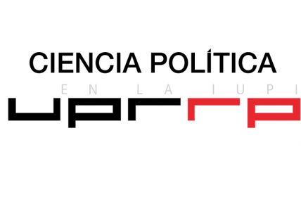
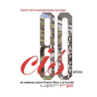
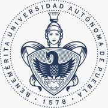
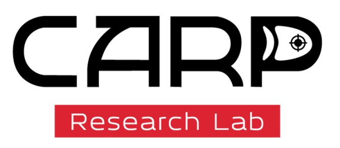
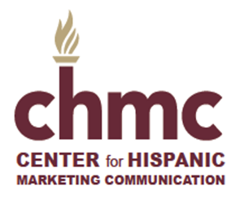
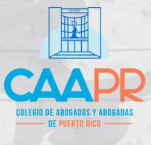

## Lunes 23 de febrero

### Universidad de Puerto Rico-Recinto de Río Piedras

Anfiteatro de la Facultad de Ciencias Sociales, Salón REB 238

Para ver vía Zoom las presentaciones en la UPR-RP, haga registro en el
siguiente enlace:

[**[https://us02web.zoom.us/\.../register/caQva4hGThSSpY2NY40s2A]**](https://us02web.zoom.us/meeting/register/caQva4hGThSSpY2NY40s2A?fbclid=IwZXh0bgNhZW0CMTAAYnJpZBEycENjd1lFd2Z0TmVZY0dBaHNydGMGYXBwX2lkEDIyMjAzOTE3ODgyMDA4OTIAAR5pMakHDiARVtMBJBqCanp7BarNh0Rym4kns6kdtdw54LquKV3Htd83E_Ma6A_aem_LYdcYrGVkmYDLjZCWJnphA)

Estudiantes que tengan interés de hablar sobre proyectos preliminares de
investigación y/o de opciones para estudiar en México, Barcelona,
República Dominicana y EEUU deben enviar mensaje o llamar a Federico
Subervi (<subervif@gmail.com>, 512-965-5267) para coordinar reunión con
profesores de esos lugares.

#### 8:30 -- 9:30 a.m.: Registro y café

#### 9:30 -- 10:00 a.m.: Apertura

📋 Ver detalles

- Bienvenida: **Dra. Milagros Méndez Castillo,** Decana, Facultad de
Ciencias Sociales, UPR-RP

- Propósitos y metas: **Dr. Maximiliano Dueñas Guzmán**, UPR-Humacao

**[10:00 -- 10:45 a.m.: Marcos de referencia sobre la comunicación
política (CP)]**

📋 Ver detalles

- Breve mirada holística a la comunicación política: **Dr. Federico
Subervi Vélez**, UPR-RP y Universidad de Wisconsin

- Nuevas fronteras y retos de la comunicación política en la era de la
IA y los trolls. **Iván Cardona, Jr., MBA, MS, MA, MGC**

#### 10:45 -- 11:00 a.m.: Receso

#### 11:00 -- 11:45 a.m.: Conferencia Magistral

📋 Ver detalles

- De ciudadanos soberanos a sujetos dirigidos: el impacto de la
desinformación potenciada por IA en procesos de erosión democrática.
**Dr. Martín Echeverría**, Benemérita Universidad Autónoma de Puebla.
Presentado por Federico Subervi

**[11:45 a.m. -- 12:15 p.m.: Reflexiones sobre la charla magistral;
preguntas y respuestas]**

📋 Ver detalles

- **Dra. Haydée Seijo Maldonado,** UPR-RP **y Lcdo. Daniel Nina**, *El
Post Antillano*

#### 12:30 -- 2:00 p.m.: Receso de almuerzo

**[2:00 -- 4:00 p.m.: Macro perspectivas nacionales e
internacionales]**

📋 Ver detalles

- Moderadora: **Dra. Mayra Vélez Serrano**, UPR-RP

- La comunicación política en Puerto Rico vista desde la teoría de la
caja de cartón. **Dr. José Miguel La Torre Ramos**, Relaciones
Internacionales de Empleo y Recursos Humanos

- ‡ Deepfakes in Subversive Strategic Communication: Challenges and
Responses. **Dr. Sergei Samoilenko**, George Mason University.
(presentación virtual en inglés, desde Washington, DC)

- Más allá de la mediatización: la plataformización y la
hipermediatización de la política. **Dr. Manuel Alejandro Guerrero**,
Universidad Iberoamericana, Ciudad de México

**[4:00 p.m.: Cierre de actividades de la tarde y anuncios de próximos
eventos.]**

📋 Ver detalles

‡ Presentación virtual

El **Departamento de Ciencia Política** de la UPR-RP,
es una unidad académica dedicada a la docencia, la investigación y el
servicio público, y constituye uno de los principales referentes en el
estudio de la política en Puerto Rico y el Caribe. Desde el Departamento
se desarrollan proyectos de investigación competitivos y colaboraciones
interinstitucionales de alto impacto, así como iniciativas orientadas a
la formación metodológica, el análisis de datos, la opinión pública y el
debate público informado. Las áreas de trabajo incluyen, entre otras,
teoría política, política comparada, política puertorriqueña,
comportamiento político, opinión pública, género y política, y
relaciones internacionales, con resultados que se difunden regularmente
en revistas académicas, libros y espacios de divulgación pública.

**Centro de Investigaciones Sociales** de
la UPR-RP está dedicado a la investigación interdisciplinaria en las
ciencias sociales, y es uno de los principales espacios de producción de
conocimiento crítico sobre la realidad social, política y económica de
Puerto Rico y el Caribe por los últimos 80 años. Reúne a investigadores
e investigadoras con una sólida trayectoria académica, cuyas líneas de
trabajo abordan problemáticas centrales como desigualdad social,
políticas públicas, desarrollo, migración, trabajo, salud, educación y
transformaciones sociales contemporáneas. Desde el CIS se desarrollan
proyectos de investigación competitivos, colaboraciones nacionales e
internacionales, y actividades de divulgación académica y pública,
contribuyendo activamente al debate informado y a la formulación de
políticas basadas en evidencia.

**Centro de Estudios de Comunicación

Política de la Benemérita Universidad Autónoma de Puebla (México).**
Es una unidad de investigación de la BUAP y uno de los principales
referentes nacionales en el estudio de la comunicación política. Sus
integrantes cuentan con altas acreditaciones oficiales como
investigadores, participan activamente en asociaciones académicas
internacionales y lideran líneas de investigación consolidadas. El
Centro colabora en proyectos internacionales de prestigio, como Worlds
of Journalism y Journalistic Role Performance, así como con
instituciones de referencia como la Fundación Gabo. Sus investigaciones
se concentran en temas como prensa y poder, estudios de periodismo,
campañas electorales y discurso político, que se publican de manera
regular en revistas y editoriales académicas de reconocido impacto
internacional. Para más información, contacte al Dr. Martín Echeverría:
<martin.echeverria@correo.buap.mx>

The **Lab for Character Assassination and

Reputation Politics** is an interdisciplinary research team of scholars
studying character assassination and reputation protection. The team
focuses efforts along 3 main dimensions: research on historical and
contemporary examples of character assassination; education for academic
and public audiences about character assassination causes, impacts and
prevention; and risk assessment to determine vulnerabilities and
mitigation strategies for public figures concerned about their
reputations. (<https://communication.gmu.edu/research-and-centers/carp>)

El **Center for Hispanic Marketing

Communication** de Florida State University, fundado en 2004 y ubicado
en el *School of Communication*, se dedica a la enseñanza e
investigación del mercadeo y comunicación dirigida a consumidores
hispanos y multiculturales. Es un recurso para la industria,
respondiendo a la necesidad de profesionales capacitados en un mercado
en rápido crecimiento. A través de cursos, certificados, conferencias,
becas, pasantías y mentoría, el Centro forma talento y fortalece el
conocimiento estratégico sobre el mercado hispano. Lo lideran el Dr.
Korzenny (fundador), la Dra. Sindy Chapa (Directora Asociada), la Dra.
Betty Ann Korzenny (cofundadora) y un comité de expertos de la
industria. Visite <https://hmc.comm.fsu.edu/> o comuníquese con Sofia
Otto <smo20bb@fsu.edu>.

## Lunes 23 de febrero (continuación)

### Colegio de Abogados y Abogadas de Puerto Rico

**Avenida Ponce de León 808, Miramar**

**Sala Félix Ocheteco**

#### 6:00 -- 6:30 p.m.: Registro

**[6:30 -- 6:45 p.m.: Bienvenida: Lcda. Vivian Godineaux Villaronga,
Presidenta del CAPR]**

#### 6:45 -- 8:15 p.m.: Panel

📋 Ver detalles

**[• Aspectos legales y éticos del uso de la IA en campañas electorales
y propaganda gubernamental.]**

- **Lcdo. Daniel Nina, moderador y participante**

- **Senadora, Dra. Ada Álvarez Conde**

- **Lcdo. Luis Alberto González**

- **Lcdo. Rafael Silva Almeyda**

#### 8:15 -- 8:30 p.m.: Preguntas y respuestas

#### 8:30-- 9:00 p.m.: Recepción (pendiente a confirmar)

📋 Ver detalles

**Comisión de Tecnología**. **Visión:** Ser
el ente líder en Puerto Rico en la transformación tecnológica de la
profesión legal, promoviendo una práctica del derecho moderna, ética,
eficiente y centrada en el servicio a la ciudadanía. **Misión:**
Impulsar la educación tecnológica accesible para la comunidad jurídica,
fomentar el uso responsable y ético de la tecnología, asesorar
estratégicamente al Colegio en temas tecnológicos y promover la
innovación y la discusión de política pública que modernice la
administración de la justicia. 

**Comisión de Propiedad Intelectual: Misión:** Impulsar el desarrollo,
conocimiento y protección de la propiedad intelectual en Puerto Rico,
ofreciendo herramientas educativas y análisis legal a los abogados,
autores, inventores y al público en general. **Visión:** Ser el
organismo rector y de referencia en Puerto Rico para el análisis y la
formulación de políticas sobre derechos de autor, marcas, patentes y
asuntos relacionados con el derecho de propiedad intelectual en la era
digital.

**Palabras de Bienvenida de Dra. María Vera Hernández,**

**Decana Escuela de Comunicación Ferré Rangel y**

**Ingeniera Sandra Pedraza, Decana de la Escuela de Educación General**

**Universidad del Sagrado Corazón**

La Escuela de Comunicación Ferré Rangel y la Escuela de Educación
General de la Universidad del Sagrado Corazón se complacen en acoger
el *Ciclo de Conferencias: Comunicación Política en la Era de la
Inteligencia Artificial*, un espacio de reflexión académica que reúne a
profesores y estudiantes de diversas instituciones académicas en torno a
investigaciones contemporáneas sobre los profundos cambios que
experimenta la comunicación política en contextos tecnológicos
emergentes.

Este Ciclo propicia un diálogo interdisciplinario para explorar cómo la
inteligencia artificial, las dinámicas digitales y los nuevos
ecosistemas mediáticos están transformando las narrativas políticas, la
participación ciudadana y los procesos de representación simbólica a
nivel local y global.

Nuestra comunidad universitaria está comprometida con aportar al
conocimiento a través de la investigación, la cual constituye una parte
integral de los ofrecimientos académicos desde el nivel subgraduado.
Promover y participar en estos espacios de diálogo y reflexión resulta
fundamental para el desarrollo del pensamiento crítico, la innovación y
la formación de profesionales conscientes de los retos contemporáneos de
la comunicación.

Estamos seguras de que este Ciclo de Conferencias generará un importante
intercambio académico, con el propósito de continuar fomentando la
investigación, el pensamiento crítico y el análisis responsable de la
inteligencia artificial en los procesos comunicativos contemporáneos.

Les damos la más cordial bienvenida y esperamos que estas reflexiones
sirvan como punto de partida para nuevas conversaciones, estudios y
propuestas que fortalezcan una comunicación política más ética, humana y
consciente de su impacto social.

---

  <a href="index.md" class="nav-button prev">← Inicio</a>
  <a href="index.md" class="nav-button home">🏠 Inicio</a>
  <a href="martes-24.md" class="nav-button next">Martes 24 de febrero →</a>

