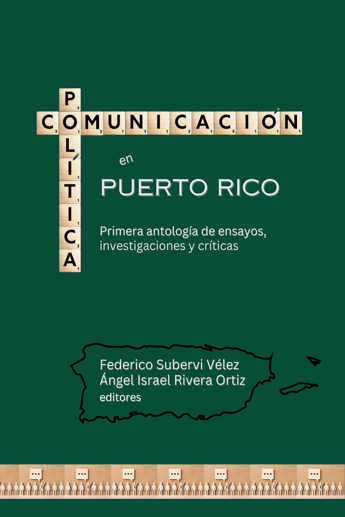
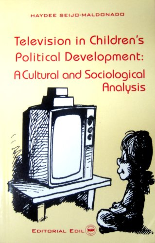
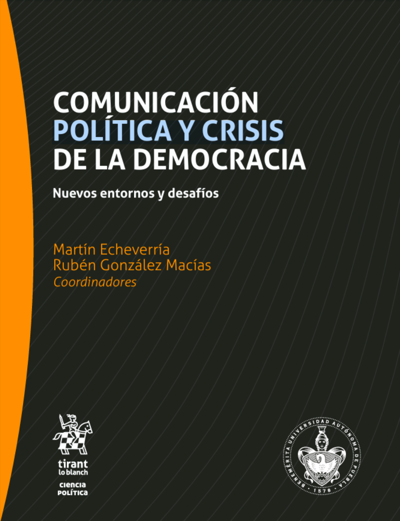
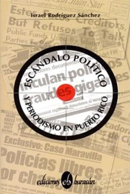

## Martes 24 de febrero

**Universidad del Sagrado Corazón**

**Parada 26-1/2, Calle Rosales, Esq. San Antonio, San Juan**

**Salón CoWork**

#### 8:30 -- 9:00 a.m.: Registro

#### 9:00 - 9:10 a.m.: Bienvenida

📋 Ver detalles

- **Dra. María Vera Hernández**, Decana, Escuela de Comunicación Ferré
Rangel

- **Ingeniera Sandra Pedraza**, Decana, Escuela de Educación General

[**9:10 - 10:30 a.m.:** **Presentaciones de investigaciones de
USC**]

- Moderadora: **Dra. Nadesha Karina González**

- Del meme de internet al contenido IA: Una mirada netnográfica a la
representación y estética "cringe" en la comunicación político-electoral
puertorriqueña y latinoamericana. **Dr. Luis Cintrón-Gutiérrez**, USC

- Cuando el discurso deja de sentir: inteligencia artificial y la
deshumanización de la comunicación** **política. **Dr. Gabriel Paizy,**
USC

**•** La nueva Torre de Babel: comunicación global después de la
unipolaridad. **Dr. Ojel Rodríguez**, USC

- ‡ Afectos algorítmicos: IA, el subconsciente político y el discurso
contemporáneo. **Dr. Javier Clavere**, University of the Incarnate Word
in San Antonio, Texas

**[10:30 - 11:00 a.m.: Sesión de Posters de los estudiantes de
GIV] **

📋 Ver detalles

**•** Corrupción municipal, justicia y responsabilidad: La triada
fallida del gobierno. **Paola Robles Marcano**

- El estado político y su efecto en los artistas puertorriqueños.
**Natalia Pérez Berríos**

- Voto juvenil e impacto eleccionario. **Alondra Martínez Class**

- Impacto de la IA a los artistas. **Laura Ortiz Cuebas**

- El impacto de la IA generativa en la creación de contenido visual:
Plagio y derechos de autor. **Francisco Colón Ordoñez**

#### 11:00 - 11:15 a.m.: Receso

#### 11:15 a.m. - 12:00 p.m.: Charla Especial

📋 Ver detalles

- ‡ De la calle a lo internacional: comunicaciones diplomáticas en la
era de TikTok y ChatGPT. **Licenciado Joaquín Monserrate**,
Profesor Universidad de la Ciudad de Nueva York (CUNY) y Universidad del
Sagrado Corazón

**[12:15 p.m.: Cierre de conferencia en Sagrado y anuncios de próximas
actividades]**

📋 Ver detalles

‡ Presentación virtual

## Martes 24 de febrero (continuación)

**Librería Norberto, Plaza Las Américas**

**El evento se transmitirá a través del canal de YouTube de esta
librería**

**[7:00 -- 9:00 p.m.: Conversatorio y presentación de libros de
comunicación política.]**

📋 Ver detalles

- Moderador: Vicente Pietri, analista político, Radio WSOL 1090 AM

- *Comunicación Política en Puerto Rico: Primera antología de ensayos,
investigaciones y críticas*, de **Federico Subervi Vélez y Ángel Israel
Rivera Ortiz (editores)**

- *Television in Children's Political Development: A cultural and
sociological analysis*, de **Haydée Seijo Maldonado**

- *Comunicación Política y Crisis de la Democracia: Nuevos entornos y
desafíos*, de **Martín Echeverría y Rubén González Macías
(coordinadores)**

---

  <a href="{{ site.baseurl }}/lunes-23" class="nav-button prev">← Lunes 23 de febrero</a>
  <a href="{{ site.baseurl }}/index" class="nav-button home">🏠 Inicio</a>
  <a href="{{ site.baseurl }}/miercoles-25" class="nav-button next">Miércoles 25 de febrero →</a>

