Semblanzas y fotos de participantes

(en orden alfabético por apellido)

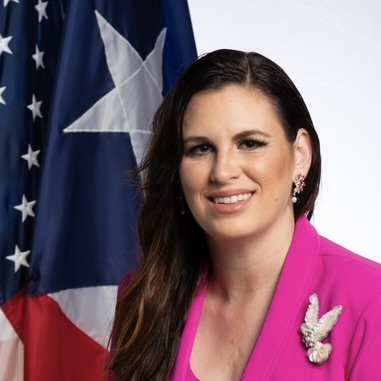

**Senadora Ada Álvarez Conde**. Tiene

👤 Ver biografía completa

doctorados en Historia de Puerto Rico y el Caribe, y en Neuroteología
Cristiana. Estudió periodismo en la UPR-RP y Maestría en Ciencias en
Comunicaciones de Florida International University. Lleva 13 años en
diversas faenas de comunicación política; fue reportera de Telemundo
Nacional y especialista en Comunicaciones de la Organización
Panamericana de la Salud. Ha laborado como profesora de la Universidad
del Sagrado Corazón, la Universidad Ana G. Méndez, y el Centro de
Estudios Avanzados de Puerto Rico y el Caribe. Dirigió la Comisión de
Asuntos de las Mujeres del Senado. Es autora de *Lo Que No Dije*, novela
en la cual aborda la crisis de violencia, tema respecto al cual ha
desarrollado programas de orientaciones en las escuelas en Puerto Rico y
la ha convertido en especialista a nivel mundial. En el 2008, publicó el
poemario *Mudanza Constante* y en el 2024, *Corazón Abierto*,
autobiografía de su historia como paciente de una condición congénita
cardíaca.

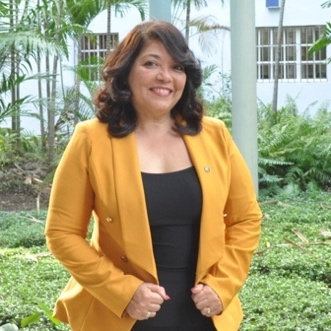

**Dra. Alicia Álvarez.** Doctora en

👤 Ver biografía completa

Comunicación Social, Cum Laude, por las universidades Abat Oliba- CEU,
San Pablo y Cardenal Herrera, Programa de Comunicación Social,
Barcelona, Madrid y Valencia. Es diseñadora de comunicación visual y
Máster en Ciencias de la Comunicación (especialidad Comunicación
Organizacional). Es profesora titular de grado y posgrado y dirige la
Dirección de Artes y Comunicación, de la Universidad APEC, Santo
Domingo, República Dominicana. Es miembro de la Junta Directiva de la
Red Iberoamericana de Investigadores en Publicidad y de la Red
Iberoamericana DirCom. Además, dirige la Regional Caribe de la
Federación Latinoamericana de Facultades de Comunicación Social
(FELAFACS) y es miembro de la Red de Investigadores en Diseño,
Universidad de Palermo, Argentina. Ha publicado artículos sobre diseño,
comunicación corporativa y comunicación estratégica en revistas y
libros, así como tres libros sobre Comunicación Organizacional e Imagen
Corporativa. Ha sido conferencista y ponente en múltipes países de
América Latina.

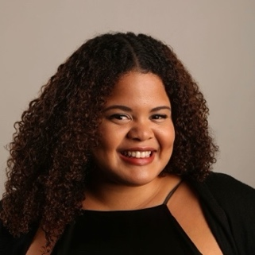

**Edmy Angélica Ayala Rosado.**

👤 Ver biografía completa

Investigadora, comunicadora científica y periodista de Puerto Rico.
Tiene bachillerato en Información y Periodismo y maestría en
Comunicación con especialidad en Teoría e Investigación, ambos de la
UPR-RP. Para la maestría hizo investigación sobre salud de las mujeres
en Puerto Rico y comunicación en salud. Investiga traducción de
evidencia, comunicación del conocimiento y el alcance comunitario en
proyectos de educación y memoria colectiva. Colabora con equipos
interdisciplinarios para fortalecer el vínculo entre producción
académica, instituciones culturales y comunidades. Tiene experiencia en
la gestión de proyectos de comunicación en contextos universitarios,
organizaciones sin fines de lucro y medios públicos, incluyendo Ciencia
Puerto Rico, el Centro para la Reconstrucción del Hábitat, y Cadena
Radio Universidad. Su labor se guía por principios de ética, acceso al
conocimiento y compromiso con el bienestar colectivo en Puerto Rico.

**Iván Cardona Jr., MBA, MS, MA, MGC.** Destacado académico y estratega
de comunicaciones con más de dos décadas de experiencia en relaciones
públicas, mercadeo, comunicación política y gestión institucional. Ha
ocupado puestos de liderazgo en agencias nacionales e internacionales,
guiando iniciativas de alto impacto en comunicación corporativa, manejo
de crisis y desarrollo de estrategias integradas para sectores públicos
y privados. Como profesor universitario y director graduado del programa
de Maestría en Relaciones Públicas en la Lawrence Herbert School of
Communication, formó nuevas generaciones de comunicadores con un enfoque
en investigación, ética y práctica profesional. También ha colaborado
con líderes gubernamentales, organizaciones sin fines de lucro y
corporaciones globales. Actualmente, se desempeña como analista
político, así como asesor en el desarrollo de programas académicos en
varias disciplinas, incluyendo administración de empresas, gerencia,
mercadeo, manejo de marcas corporativas, comunicaciones, relaciones
públicas, periodismo y transformación digital.

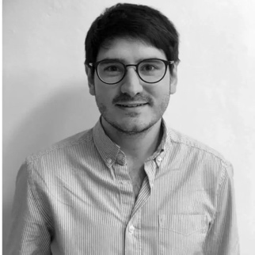

**Dr. Santiago Castelo.** Consultor en

👤 Ver biografía completa

comunicación y director adjunto de
[**ideo**grama](https://ideograma.org/) (Barcelona) una empresa de
consultoría en comunicación política y corporativa que trabaja para
España y Latinoamérica. Doctor en Comunicación por la Universidad Pompeu
Fabra, ejerce también como profesor invitado en diversos másteres. Autor
de *La biografía en comunicación política* (2023)
<https://www.editorialuoc.com/la-biografia-en-comunicacion-politica> y
editor de *Influencers y comunicación política* (2025)
<https://www.editorialuoc.com/influencers-y-comunicacion-politica>

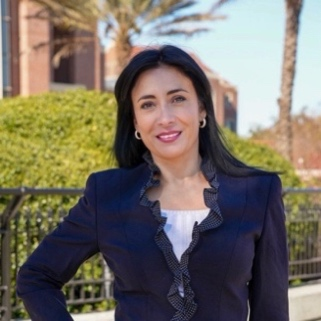

**Dra. Sindy Chapa**. Profesora Titular y

👤 Ver biografía completa

Directora del Center for Hispanic Marketing Communication de la Florida
State University. Reconocida a nivel internacional por su experiencia en
el comportamiento del consumidor multicultural y su influencia en la
publicidad, el branding y la comunicación de marketing. Ha impartido
docencia y realizado investigación en EE.UU., América Latina y Asia.
Anteriormente se desempeñó como Directora Asociada del Center for the
Study of Latino Media & Markets en Texas State University. Su
investigación se centra en el comportamiento del consumidor hispano y
transcultural, la comunicación estratégica y la efectividad del
marketing. Lidera iniciativas de mentoría y becas reconocidas a nivel
internacional que apoyan a estudiantes, ayudándolos a desarrollar
habilidades y trayectorias profesionales. Su investigación actual
examina el uso de la inteligencia artificial y el *big data* en la
comunicación de marketing, con especial atención a aplicaciones éticas,
culturales y centradas en las audiencias en contextos diversos y
globales.

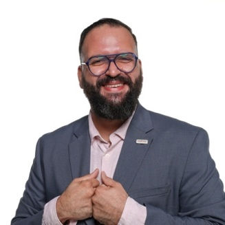

**Dr. Luis Javier Cintrón-Gutiérrez.**

👤 Ver biografía completa

Catedrático auxiliar de Investigación y Exploración en la Universidad
del Sagrado Corazón, donde se desempeña como líder académico de
Destrezas del Siglo XXI en la Escuela de Educación General. Investiga la
narcocultura, marginalidad y experiencias urbanas en el Caribe hispano.
Es autor de *El muerto parao: Velorios, marginalidad y performance en el
Puerto Rico contemporáneo*. Posee doctorado en Estudios
Latinoamericanos, Caribeños y Latinos en Estados Unidos de la University
at Albany, SUNY, maestría en Sociología de la UPR-RP, y maestría en
Medios de Comunicación y Cultura Contemporánea de la Escuela de
Comunicación Ferré Rangel. Su bachillerato en Ciencias Políticas es de
UPR-Mayagüez. Ha enseñado en la University at Albany y el Massachusetts
College of Liberal Arts, y asistente de investigación en el Centro de
Investigación Social UPR-RP, el Centro de Investigación Social Aplicada
y el Centro Interdisciplinario de Estudios Costeros UPR-Mayagüez. Dirige
la sección de Cultura, Poder y Política de la Latin American Studies
Association.

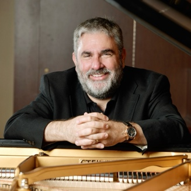

**Dr. Javier Clavere** is Dean of the

👤 Ver biografía completa

College of Humanities, Arts, & Social Sciences at the University of the
Incarnate Word in San Antonio, Texas. An award-winning polymath,
scholar, and performer, his decades of research span systems theory,
entrepreneurship, Stoicism, Pragmatism, Christianity, sacred and popular
music, Foucauldian studies, and semiotics and globalization, among
others. His scholarship includes peace and conflict transformation
through the arts, systemic change, transformational leadership, higher
education administration, assessment, and strategic program design. He
has led training initiatives in design thinking, executive coaching,
conflict resolution, humanistic management, organizational culture, and
innovation. His TEDx presentations introduced his evolving model of
"Humanistic Entrepreneurship" and research on AI and cognition
"Plagiarism in the Age of AI." In 2019, he received a Lifetime
Achievement Award and the title of "Distinguished Citizen," from the
City of Rosario and the National University of Rosario.

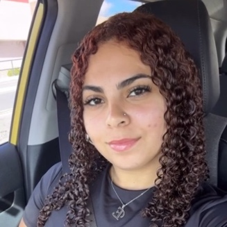

**Esmeralda Colón Ramos**. Estudiante de

👤 Ver biografía completa

Ciencias Sociales con interés especial en Ciencias Políticas con miras a
estudios graduados en Demografía y Administración Pública para poseer
una carrera en el gobierno.

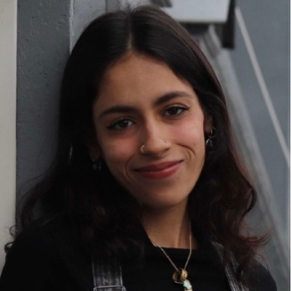

**María Isabel Colón Torres**. Estudiante

👤 Ver biografía completa

subgraduada de Ciencias Sociales generales con énfasis en estudios
puertorriqueños, con interés en estudios de posgrado en comunicación
política y trabajo social para una carrera profesional como educadora,
entre otras cosas.

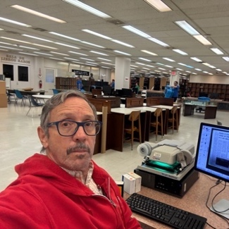

**Dr. Luis Fernando Coss.** Profesor de la

👤 Ver biografía completa

Escuela de Comunicación de la Universidad de Puerto Rico desde 1987
hasta su jubilación en 2022. Fue Director del periódico *Claridad*,
cofundador del mensuario *Diálogo*, coordinador de la serie
"Periolibros", fundador del semanario *Palique* y ayudante especial de
la Presidenta de la Corporación de Difusión Pública de Puerto Rico
(Radio y Televisión). Completó su doctorado con un trabajo de
investigación sobre la historia del concepto del "periodismo
profesional". Fundador de "Zona Franca" que produjo trece programas
largos para la TV pública, incluyendo, "Vieques en el espejo de Panamá",
premiado con un Emmy. En 1996 publicó *La nación en la orilla: respuesta
a los posmodernos pesimistas* y en 2017 *De El Nuevo Día al periodismo
digital: trayectorias y desafíos*. En el 2002 recibió el Premio por la
Paz del capítulo de la UNESCO de Puerto Rico.

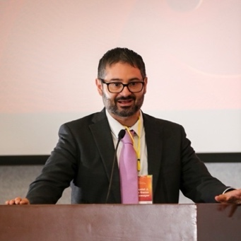

**Dr. Daniel Javier de la Garza

👤 Ver biografía completa

Montemayor.** Es Doctor en Ciencias Sociales por la Universidad Pablo de
Olavide (España) y Doctor en Filosofía con orientación en Ciencias
Políticas por la Universidad Autónoma de Nuevo León (México). Es
Licenciado en Derecho y Maestro en Innovación Empresarial y Tecnológica
por el Instituto Tecnológico y de Estudios Superiores de Monterrey
(ITESM), donde obtuvo el grado de Master of Science in Management. Es
miembro del Sistema Nacional de Investigadoras e Investigadores (SNII),
Nivel I. Actualmente se desempeña como Profesor Investigador Asociado de
tiempo completo en la Universidad de Monterrey, adscrito al Departamento
de Administración. Ha participado como ponente en congresos académicos y
ha impartido seminarios, diplomados y conferencias universitarias. Su
labor académica se ha desarrollado en distintos estados de México.
Cuenta con una sólida producción académica que incluye libros, capítulos
y artículos en revistas científicas indexadas, centrados en procesos
sociales, culturales y comunicativos contemporáneos.

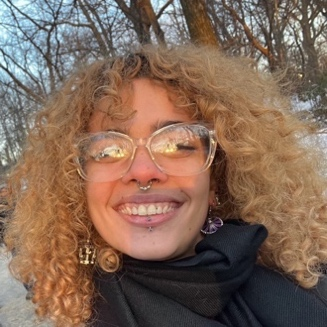

**Andreas Díaz Correa**. Estudiante de

👤 Ver biografía completa

Ciencia Política y Periodismo con interés especial en política pública y
comunicación política, con miras a estudios graduados en Derecho,
particularmente un Juris Doctor.

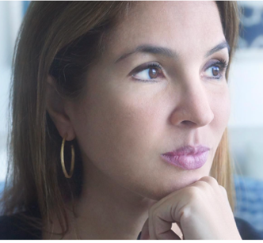

**Dra. Anilyn Díaz Hernández.**

👤 Ver biografía completa

Catedrática en el Departamento de Comunicación Tele-Radial, UPR-Arecibo
e imparte cursos de teoría, práctica supervisada y producción de cine,
radio y televisión en Arecibo y UPR-Río Piedras. Tiene doctorado en
Comunicación, con énfasis en Política Pública sobre medios y cultura, de
la Universidad de Massachusetts-Amherst. Tiene vasta experiencia en la
industria del cine con producciones de videos musicales, corporativos,
publicidad e investigación. Equilibra la docencia con proyectos de
investigación, escritura creativa y producción para diversos medios y
eventos musicales. Autora de "Media, Race and Ethnicity in Puerto Rico"
para *Oxford Encyclopedia of Race, Ethnicity and Communication*. Cuenta
con 10 nominaciones a premios NATAS Suncoast Student Production Awards.
Fue becada en el Ithaca College's Finger Lakes Environmental Film
Festival y parte de la Junta Asesora del Puerto Rico Film Festival. Es
miembro de la Junta Directiva de la Fundación Nacional para la Cultura
Popular.

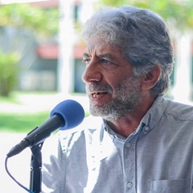

**Dr. Maximiliano Dueñas Guzmán.** Nació

👤 Ver biografía completa

en Colombia, se crió en Nueva York y vive en Puerto Rico desde 1986. Se
considera *coloniuyorican* pues gran parte de su perspectiva de vida se
cristalizó en experiencias de la izquierda puertorriqueña en Nueva York.
Como estudioso, explora prácticas que avalan a la comunicación como un
derecho humano. Ha publicado sobre proyectos de comunicación popular;
fungido como coordinador para el Caribe hispanoparlante del Global Media
Monitoring Project (GMMP), un estudio sobre la representación de la
mujer en las noticias; ha presidido asociaciones académicas de
comunicación en Puerto Rico, el Caribe y América Latina. Es profesor
jubilado del Departamento de Comunicación de la UPR, Humacao, anfitrión
del programa radial, *Cultura de la conversación*, transmitido por Radio
Web (UPRH) y columnista de la publicación digital *80Grados*.
Recientemente publicó el libro *Pistas para el estudio de la
comunicación*. Su PhD. es de la Universidad de Massachusetts, Amherst.

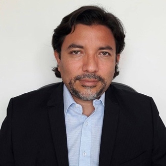

**Dr. Martín Echeverría.** Doctor en

👤 Ver biografía completa

Comunicación y Cultura por la Universidad de Sevilla. Coordinador del
Centro de Estudios en Comunicación Política de la Benemérita Universidad
Autónoma de Puebla y cocoordinador de la Sección de Comunicación
Política de la Asociación Internacional de Investigación en Medios y
Comunicación (IAMCR). Autor y/o editor de 11 libros y más de 50
artículos académicos publicados en revistas científicas internacionales.
Sus trabajos han sido publicados en *The International Journal of
Press/Politics, International Journal of Communication, Journalism
Studies y Journalism Practice*, entre otras. Sus libros *Media and
Politics in Post-Authoritarian Mexico: The Continuing Struggle for
Democracy* (2024) y *Political Entertainment in Post-Authoritarian
Mexico: Humor and the Mexican Media* (2023) fueron galardonados en 2024
y 2025, respectivamente, con el premio Knudson de la Asociación para la
Educación en Periodismo y Comunicación de Masas (AEJMC) para el mejor
libro sobre medios en América Latina.

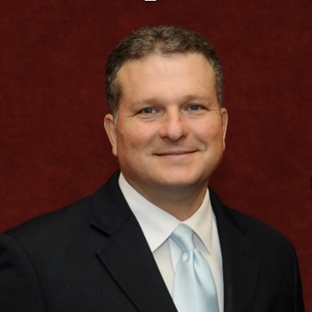

**Dr. Julio E. Fontanet Maldonado**.

👤 Ver biografía completa

Decano y Catedrático de la Facultad de Derecho de la Universidad
Interamericana de Puerto Rico donde dicta cursos de Procedimiento Penal,
Derecho Penal, Derecho de la Prueba y Derecho Penal Internacional.
Obtuvo licenciatura en Ciencias Políticas de la *University of Central
Florida* y el grado de Derecho de la Universidad Interamericana de
Puerto Rico. Cuenta además con una Maestría de la Universidad de
Chicago, post grado de la Universidad Complutense de Madrid y Doctorado
en Derecho de la Universidad del País Vasco. Ha sido profesor visitante
y conferenciante en varias universidades en los EE.UU., Centro y Sur
América, Italia y España. Comenzó a ejercer la abogacía como defensor
público en Puerto Rico, donde participó en múltiples procesos de
naturaleza penal; presentó por primera vez el síndrome de la mujer
maltratada en el contexto de una legítima defensa en casos de asesinato.
Autor de *Principios y Técnicas de la Práctica Forense*, *Alegación
Preacordada en los Estados Unidos*, *El Proceso Penal de Puerto Rico*,
*Puerto Rico en Tiempos Revueltos,* *La Percepción de la Sexualidad en
Puerto Rico*., *El derecho a la confrontación en los Estados Unido*s.

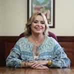

**Lcda. Vivian Godineaux Villaronga.**

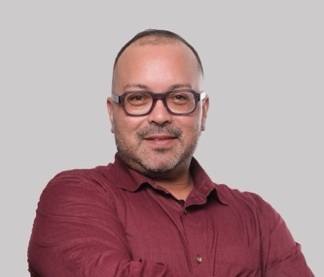

**Luis Alberto González Torres**, orgullosamente

👤 Ver biografía completa

yaucano, residente en San Juan. Periodista independiente con cerca de 20
años de experiencia, actualmente colaborador del Centro de Periodismo
Investigativo. Es abogado licenciado con interés en asuntos de Derecho
Constitucional, como la libertad de expresión, a la intimidad y el
acceso a la información pública. Además, promovente del derecho al
acceso a vivienda y sobre leyes migratorias. Es, también, profesor de
Comunicación en la Universidad del Sagrado Corazón, donde ha ofrecido
cursos sobre ley y ética, periodismo investigativo y periodismo
multimedios. Residió por nueve años en Chicago, Illinois, donde laboró
como paralegal, lo que le llevó a regresar a Puerto Rico para obtener su
Juris Doctor en la Facultad de Derecho de la Universidad Interamericana.
Ha sido miembro de la Asociación de Periodistas de Puerto Rico y el
Overseas Press Club y otras organizaciones pro derechos de los
ciudadanos.

**Dra. Nadesha Karina González.** Tiene un

👤 Ver biografía completa

doctorado en Filosofía y Letras con especialidad en Literatura
Puertorriqueña y del Caribe del Centro de Estudios Avanzados de Puerto
Rico y el Caribe. Su tesis doctoral versó sobre la representación
sociopolítica en la cuentística dominicana en la década del sesenta.
Cursó maestría en Literatura Española en New York University y
bachillerato en Comunicación Pública en la UPR-RP. También cuenta con un
Grado Asociado en Humanidades de la UPR-Aguadilla. Ha impartido cursos
en de Comunicaciones, Literatura y Lengua Española en varias
instituciones del país. Igualmente, ha ocupado puestos administrativos
dentro de la academia. Asimismo, es una profesional de las
comunicaciones con veinte años de experiencia en medios audiovisuales e
impresos, en Puerto Rico y Estados Unidos. Durante ese periodo se
desempeñó exitosamente como periodista radial, de prensa escrita y
televisión. Además, ha dirigido varias publicaciones sobre estilos de
vida

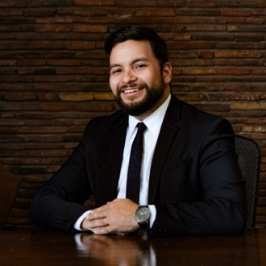

**Lcdo. Rafelli González Cotto** es

👤 Ver biografía completa

profesor universitario, abogado y periodista con más de 17 años de
experiencia en medios tradicionales y digitales en Puerto Rico. Ha
dirigido redacciones, desarrollado estrategias editoriales y liderando
proyectos de crecimiento de audiencias en plataformas digitales. Cuenta
con experiencia en periodismo político, legal y de interés público, así
como en manejo de contenido y redes sociales. Posee un Juris Doctor y
está admitido a la práctica legal ante el Tribunal Supremo de Puerto
Rico y de los Estados Unidos, desde donde ha defendido el derecho a la
libertad de expresión, prensa y acceso a la información pública.

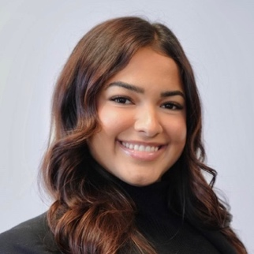

**Isabelle Gouverneur** is a master's

👤 Ver biografía completa

student in Clinical Mental Health Counseling. She holds undergraduate
degrees in Business Administration and Psychology and is currently
involved in research with the Center for Hispanic Marketing
Communication. Her academic interests focus on consumer behavior and the
intersection of mental health and marketing, particularly how
psychological processes influence decision-making, identity, and
engagement within diverse communities.

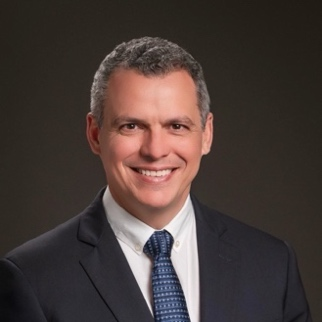

**Sergio Antonio Grullón, MA**. Ingeniero

👤 Ver biografía completa

industrial (Georgia Institute of Technology) con más de tres décadas de
experiencia entre academia, investigador y emprendedor. Habiendo vivido
en un ambiente político como servidor público, decidió dedicar su vida
académica a cómo evaluar la veracidad de contenido distribuido en redes
sociales y la intención oculta de quien lo produce dentro del ámbito de
la comunicación política; cursa el Doctorado en Comunicación en la
Universidad APEC. Se desempeñó como consultor investigador para el
Georgia Tech Research Institute, con una reconocida carrera que incluye
patente. Académicamente, se ha desempeñado como director fundador del
Instituto Tecnológico de Las Américas, miembro de la junta de regentes
del INTEC y de la junta de directores de FUNDAPEC, y consultor académico
de la Universidad O&M.

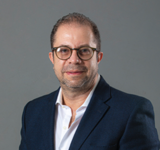

**Dr. Manuel Alvarado Guerrero**. Profesor investigador

👤 Ver biografía completa

del Departamento de Ciencias Sociales y Políticas de la Universidad
Iberoamericana. Licenciado en Relaciones Internacionales por El Colegio
de México, maestro en Estudios Latinoamericanos por la Universidad de
Cambridge y doctor en Ciencia Política, con especialidad en Comunicación
Política, por el Instituto Europeo Universitario de Florencia. Ha
dirigido Departamento de Comunicación, y coordinador académico del
Servicio Profesional Electoral del INE. Preside la Red Mundial de
Cátedras UNESCO en Comunicación y es miembro de la Academia Mexicana de
Ciencias, del Consejo Académico del Sistema de las Naciones Unidas y de
redes académicas nacionales e internacionales. Ha sido profesor
visitante en universidades de América, Europa y Asia. Su investigación
se centra en la comunicación, los medios y la democracia, las actitudes
cívicas en entornos digitales, la ética pública, la desinformación y la
inteligencia artificial. Ha publicado 12 libros y 24 capítulos
académicos, y colabora regularmente en *El Sol de México*.

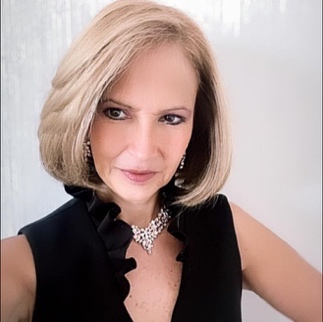

**Dra. Adriana Hernández de Lago.**

👤 Ver biografía completa

Profesional e investigadora de la innovación en contenidos a difundirse
por medio de telecomunicaciones. Licenciada en Comunicación y con
Maestría en Humanidades por la Universidad Anáhuac. Doctor en Letras
Modernas por la Universidad Iberoamericana. Actualmente cursa el
Postdoctorado en Inteligencia Artificial en Educación. Recibió en 2016
el Premio Nacional de la Mujer por ONU Mujeres y el reconocimiento como
Académica de Número por la Academia Nacional de Historia y Geografía,
UNAM. Es Vicepresidente en la Asociación Nacional de Productores y
Directores. Ha participado en medios de comunicación y ha sido
responsable de estrategias de comunicación política, así como de
formación empresarial. Docente e investigadora por 25 años en diversas
universidades privadas de México y Estados Unidos, así como
conferencista en Egipto, España, Alemania y Latinoamérica. Escritora y
Empresaria. Recibió el Doctorado Honoris Causa por la UNESCO en 2023.
Subdirector de FISEC-CINTE desde 2024.

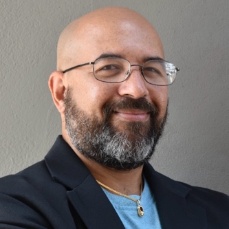

**José Hernández Falcón.** Periodista,

👤 Ver biografía completa

bloguero y columnista, apasionado por el impacto de internet en la forma
en que las personas se comunican. Ha sido profesor de periodismo,
comunicaciones, emprendimiento y redes sociales en la Universidad del
Sagrado Corazón, Sagrado Global, la Universidad Interamericana, la
Universidad Ana G. Méndez y NUC University. Es especialista de medios
digitales en SembraMedia, organización enfocada en apoyar a
emprendedores de medios digitales para lograr proyectos más sostenibles.
Además, se desempeña como especialista independiente de medios sociales
y es director del Puerto Rico BloggerCon, convención que reúne a
creadores de contenido digital en la Isla.

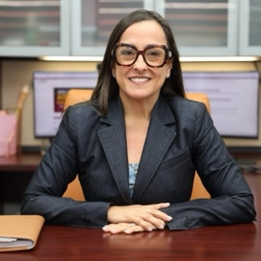

**Ivette Irizarry Santiago, Ed.D.**, es

👤 Ver biografía completa

líder universitaria y egresada en tres ocasiones de la UPR-RP. Desde
hace más de 25 años sirve a la UPR-Humacao, donde actualmente se
desempeña como Decana Interina de Administración y anteriormente dirigía
la Oficina de Planificación, Acreditación e Investigación Institucional.
Posee un Doctorado en Educación con especialidad en Liderazgo en
Organizaciones Educativas, una maestría en Administración Pública y un
bachillerato en Relaciones Laborales, de la UPR-RP. Su trayectoria
integra investigación institucional, mediación de conflictos, defensa de
la equidad y construcción de consensos. Ha sido procuradora estudiantil,
oficial de igualdad de oportunidades y funge como Enlace de Acreditación
ante la Middle States Commission on Higher Education. Bajo su liderazgo,
el diseño del Autoestudio institucional fue reconocido por la Comisión
como modelo a seguir. Su liderazgo afirma una convicción esencial:
comunicar, escuchar y liderar con humanidad fortalecen instituciones
justas y sostenibles.

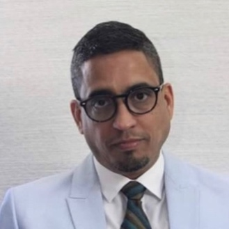

**Dr. José Miguel La Torre Ramos**. Su

👤 Ver biografía completa

preparación gira entorno a tres áreas específicas: desarrollo
empresarial, gerencia pública y relaciones internacionales de trabajo,
tanto en el sector público como en el privado. Posee un doctorado de la
Universidad Interamericana de Puerto Rico en Desarrollo Empresarial y
Gerencial con concentración en Recursos Humanos; una maestría de la
Universidad del Estado de Pensilvania en Relaciones Internacionales de
Trabajo, una maestría de la Universidad de Puerto Rico en Administración
Pública; y un bachillerato en Ciencias Sociales con concentración en
Economía (UPR-Cayey). Su experiencia en el sector público se destaca:
Asesor Auxiliar para el área de Gerencia Pública y Educación, Cultura,
Recreación y Deportes de la Gobernadora Sila M. Calderón (2001-02). De
igual forma, Ayudante Ejecutivo del Secretario de Educación de Puerto
Rico (2002-04). Además, como Director Asociado de la Oficina de Gerencia
y Presupuesto del Gobierno de Puerto Rico (2005-08).

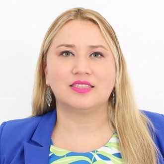

**Dra. Frambel Lizárraga Salas**. Doctora

👤 Ver biografía completa

en Ciencias Políticas y Sociales con orientación en Ciencias de la
Comunicación por la Universidad Nacional Autónoma de México. Es
profesora-investigadora en la Facultad de Ciencias Sociales de la
Universidad Autónoma de Sinaloa. Es miembro del Sistema Nacional de
Investigadoras e Investigadores (SNII) Nivel 1. Cuenta con el perfil
deseable otorgado por PRODEP de la SEP (2025-2028). En el año 2022
realizó una estancia de investigación en la Universidad de Almería,
España. Ha publicado 20 capítulos de libros, así como artículos en
revistas indizadas. Ha participado como ponente en congresos nacionales
e internacionales. En el año 2011, realizó una estancia de investigación
en la Universidad de California en Los Ángeles. Y del 2016-18 realizó
una estancia posdoctoral en el CEIICH de la UNAM. Es Presidenta de la
Asociación Mexicana de Investigadores de la Comunicación (2025-2027).

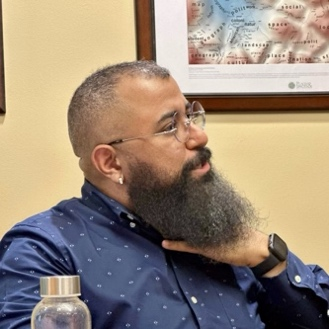

**Dr. Rashid Marcano Rivera**. Catedrático

👤 Ver biografía completa

Auxiliar de Sociología Cuantitativa en el Departamento de Sociología y
Antropología de la UPR-RP. Posee doctorado en Ciencia Política y
maestría en Estadística Aplicada de Indiana University en Bloomington, y
maestría en Economía Política de New York University. Investiga redes
políticas y corporativas, métodos computacionales y economía política
comparada. Colabora como investigador afiliado del Hamilton Lugar School
of Global and International Studies en un proyecto financiado por la
National Science Foundation sobre conexiones entre gobiernos y empresas
a nivel global, junto a los profesores Sarah Bauerle Danzman y William
Kindred Winecoff. En la UPR-RP ofrece cursos de métodos computacionales
y cuantitativos en sociología y análisis de redes sociales. Ha publicado
en *The New School Economic Review*, *The Washington Post* y *The
Conversation*. Es miembro de INSNA, APSA y la APPU.

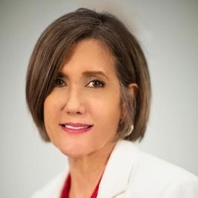

**Dra. Mirelsa Modestti González**.

👤 Ver biografía completa

Psicóloga clínica e investigadora. Posee un bachillerato en ciencias del
Recinto de Ciencias Médicas de la Universidad de Puerto Rico y un
doctorado en Psicología Clínica del Recinto de Río Piedras de la misma
universidad. Ha laborado como docente universitaria y científica social
desde 2003. Ha publicado artículos y llevado a cabo investigaciones y
adiestramientos sobre burnout, fatiga por compasión y angustia moral,
comunicación de riesgo y decisiones al final de la vida. Colabora como
recurso de la Academia Judicial Puertorriqueña y ha publicado en el
Judicial Family Institute de Estados Unidos. Mantiene una práctica
privada como psicóloga desde 2006 y ofrece servicios de investigación,
adiestramiento y consultoría en temas de Psicología, Comunicación
Estratégica, Comunicación de Riesgo y Salud, prevención de violencia y
Bioética. Es miembro-fundadora de la Red Panamericana de Bioética y
Comunicación. Es, además, comunicadora, escritora, dramaturga y
guionista de cine y televisión.

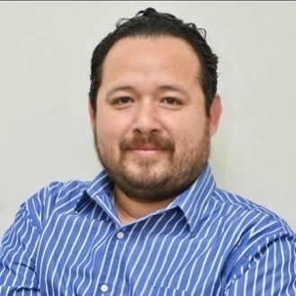

**Christian Heriberto Monge Olivarría.** Es

👤 Ver biografía completa

Licenciado en Informática y Maestro en Tecnología Educativa. Actualmente
es Candidato a Doctor en Investigación de la Comunicación por la
Universidad Anáhuac México. Además, es Profesor y Analista de Redes
Sociales del Departamento de Comunicación Social en la Universidad
Autónoma de Sinaloa. Se especializa en comunicación digital y política,
educación superior, así como en políticas públicas. Cuenta con diversas
publicaciones en revistas científicas.

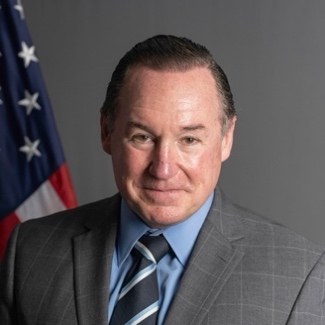

**Lcdo. Joaquín Monserrate Peñagarícano.**

👤 Ver biografía completa

Profesor universitario en la Universidad del Sagrado Corazón y en la
Universidad de la Ciudad de Nueva York (CUNY). Previo a asumir esas
funciones sirvió en el Servicio Extranjero como diplomático de carrera.
En ese rol, fungió como Subsecretario de Estado, Secretario Asistente,
Jefe de Misión y Ministro Consejero en Washington DC y en el extranjero
en sitios como India, Vietnam, México, el Caribe inglés, Indonesia,
Bolivia y Cuba. Monserrate Peñagarícano estudió historia y derecho en
las universidades de Georgetown y Puerto Rico, respectivamente. Antes de
entrar al Departamento de Estado, ejerció como abogado litigante y
periodista en Puerto Rico. Está casado con Michaela Newnham.

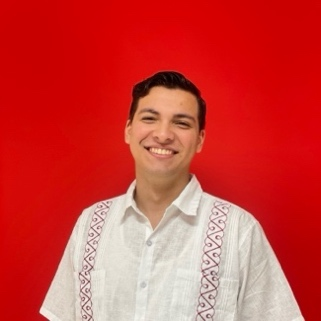

**Abdiel Montalvo Santiago.** Estudiante

👤 Ver biografía completa

del Programa Graduado en Comunicación de la UPR-RP. Oriundo de Moca,
Puerto Rico. Inició sus estudios en la Universidad de Kutztown, en
Pensilvania, con especialización en Comunicaciones y en Español y
trabajó como facilitador de talleres conversacionales y escritos en
castellano. Como estudiante subgraduado, participó en tres congresos en
los que se destacó por profundizar en temas relacionados a la
lingüística, psicología y sociología. En el 2024, obtuvo su bachillerato
y regresó a Puerto Rico para comenzar su maestría. Durante las
elecciones generales del 2024, trabajó como corresponsal para WABA
Radio. Actualmente, es mentor del Programa de Acompañamiento Académico,
en el que ayuda a los estudiantes de UPR-RP a mejorar sus habilidades de
redacción y comunicación.

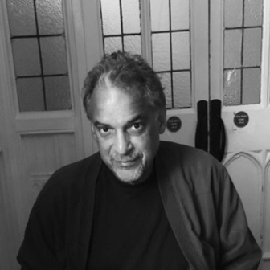

**Dr. Daniel Nina**, originario del

👤 Ver biografía completa

Caribe, es abogado, conflictólogo y profesor universitario (UPR-RP:
Facultad de Estudios Generales, Departamento de Ciencias Sociales).
Posee doctorado en teoría social del derecho (Universidad de Kent, Reino
Unido) y postdoctorado de la Universidad de Florida. Posee bachillerato
en Ciencia Política y de derecho ambas de la UPR-RP, y varias maestrías
entre otras, en Relaciones Internacionales de la Universidad de Nueva
York, en Derecho Internacional y Comparado de la Universidad de Notre
Dame, y en Historia de la Ciencia de la Universidad de Harvard. En la
actualidad cursa una maestría 3.5 en Arquitectura (UPR RP) y finaliza un
doctorado en Historia (UPR-RP). Escribe sobre conflictos y métodos
alternos, así como de derecho y literatura. Va al cine, a la playa y es
salsero \[de la mata\].

**Dr. Yamil Ortiz Ortiz** es investigador

👤 Ver biografía completa

auxiliar en el Centro de Investigaciones Sociales (CIS) de la
Universidad de Puerto Rico, Recinto de Río Piedras. Posee un doctorado
en Psicología, una maestría en Psicología Académica Investigativa y un
bachillerato en Trabajo Social. Es investigador principal del
Laboratorio de Tecnologías Emergentes (LITE Lab) y coordina el Programa
de Mentoría del CIS, apoyando el desarrollo académico y profesional del
estudiantado. Desde el LITE Lab investiga cómo tecnologías emergentes
como la realidad virtual, las redes sociales, los videojuegos y la
inteligencia artificial impactan la salud mental y el bienestar,
examinando sus efectos psicológicos, sociales, fisiológicos y
neurocognitivos, a través de la integración de herramientas como la
electroencefalografía, biomarcadores fisiológicos y medidas
psicométricas.

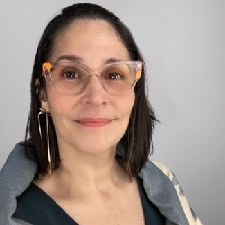

**Dra. Marcia Pacheco García.**

👤 Ver biografía completa

Especialista en comunicación visual. Posee doctorado en Historia de
Puerto Rico y el Caribe del Centro de Estudios Avanzados de Puerto Rico
y el Caribe, maestría en Comunicación Pública de la UPR-RP y
bachillerato en Diseño Gráfico de Atlantic University College. En la
UPR-Humacao, donde trabaja actualmente, obtuvo un grado asociado en
Tecnología de la Comunicación. Fue becaria del National Endowment for
the Humanities en Tampa, y asistió en dos ocasiones al Faculty Resource
Network de NYU. Ha trabajado con agencias de publicidad, periódicos,
imprentas y televisión, y otras corporaciones mediáticas. En su tesis
doctoral integró las disciplinas de historia y de comunicación para
analizar cómo periódicos cubanos, españoles y estadounidenses a finales
de 1895 presentaron el caso de una joven cubana presa. Actualmente
investiga representaciones en tirillas cómicas de artistas
puertorriqueños en la red social Instagram y cómo éstos reflejan y
aportan a la concienciación de la crisis social que enfrenta el país.

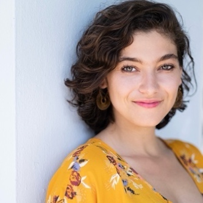

**Camille Padilla Dalmau** es periodista

👤 Ver biografía completa

multimedia, educadora y fundadora de 9 Millones, una red de noticias
independiente comprometida con amplificar las voces de las comunidades
puertorriqueñas. Actualmente, lidera las estrategias de generación de
ingresos. Además, ofrece talleres en periodismo audiovisual y es
entrenadora registrada de la Red de Periodismo de Soluciones. Sus
reportajes se centran en temas de justicia social, salud y medio
ambiente y han sido publicados en medios como: *Grist, Harvard Public
Health Magazine, Yes! Magazine, AJ+, Latino USA*, entre otros. Cuenta
con una maestría de la Escuela de Periodismo de la Universidad de
Columbia. 

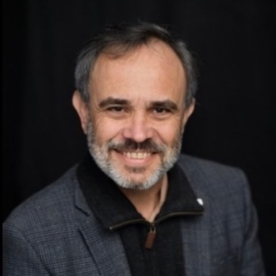

**Dr. Gabriel Paizy.** Profesor

👤 Ver biografía completa

universitario, comunicador y escritor puertorriqueño. Se desempeña como
catedrático asociado en la Universidad del Sagrado Corazón, donde
imparte cursos de comunicación estratégica a nivel de maestría y de
bachillerato. Tiene más de tres décadas de experiencia en educación
superior y ha participado activamente en procesos académicos. Su énfasis
es en el análisis del discurso, la representación mediática y el estudio
del lenguaje en contextos históricos y sociales. Durante siete años fue
de la Escuela de Comunicación Ferré Rangel de la Universidad del Sagrado
Corazón. Es autor de varios libros sobre el uso del español y
colaborador semanal del periódico *Primera Hora*. Además, dirige el
proyecto educativo En Buen Español, desde el cual promueve la
divulgación lingüística y la comunicación efectiva.

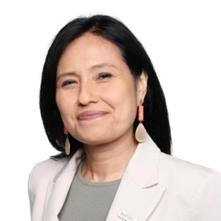

**Profesora Sandra Pedraza**. Posee

👤 Ver biografía completa

Maestrías en Ciencias en Ingeniería Metalúrgica y de Ingeniería
Mecánica. Ha promovido innovación y emprendimiento en Puerto Rico;
dirigió el programa de Startup.pr del Acelerador de Tecnologías de la
Universidad Ana G. Méndez, y la Oficina de Innovación y Emprendimiento
de dicha institución. También ha estado a cargo del Hispanic
Entrepreneurial Program for Innovation y el High School Enterprise en
Puerto Rico en asociación con Michigan Tech University, subvencionados
por la National Science Foundaation. Además, ha trabajado en iniciativas
de comercialización como el Xcelerator Network liderado por la
Universidad de Kentucky y el Fideicomiso de Ciencias Tecnología e
Investigación de Puerto Rico. Formó parte del programa Pathways for
Innovation de Venturewell. Es Decana de Educación General de la
Universidad de Sagrado Corazón, ha sido Lider Académica de la
competencia de Emprendimiento, y directora de proyectos subvencionados
por la Minority Business Development Agency bajo los programas Capital
Readiness Program (único otorgado en Puerto Rico) y Minority Colleges
and Universities Program. Fue galardonada como Pilar del Empresarismo en
Puerto Rico en el 2024.

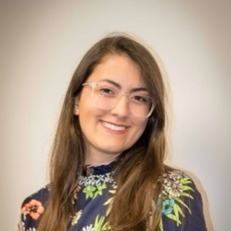

**Alessandra Noli Peschiera (M.S, Florida

👤 Ver biografía completa

State University)** is a doctoral candidate in communication theory and
research at Florida State University. She has graduate certificates in
multicultural marketing communication and project management, as well as
industry experience in communication and marketing. At FSU, she is
actively engaged in research and academic leadership, serving as the
Associate Director of the Center for Hispanic Marketing Communication
while advancing her research in strategic communication.

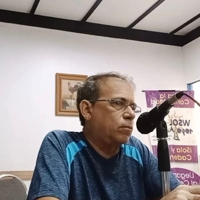

**Vicente Pietri Gomez**. Oriundo de San

👤 Ver biografía completa

Germán, Puerto Rico y graduado de Ciencias Políticas de la Universidad
Interamericana de esa ciudad. Ha estudiado temas de democracia,
decisiones públicas, política pública y marketing político en el
Institut de Govern i Politiques Públiques de Barcelona. Además, ha
participado en varias cumbres y seminarios de comunicación política y de
política pública. En 1998 comenzó ofreciendo análisis político para
"Tertuliando" y del 1999 al presente para "Análisis 1090" en WSOL-AM. En
años eleccionarios, ha participado en programas especiales de WSOL, y
como invitado al progrma "Digaselo a Raymond" de WSOL, a "Xplosion TV"
de WOLE y en Plataformas digitales como "La Opinión de Raymond" de
Lemuel TV, Directo al Punto en el Sur TV, y "Noticias Internacinales" de
TV Internacional.

**Dr. Gerardo Piñero Cádiz.** Historiador,

👤 Ver biografía completa

investigador, explorador y documentalista puertorriqueño, con doctorado
en Historia de Puerto Rico y el Caribe, del Centro de Estudios Avanzados
de Puerto Rico y el Caribe. Su área de interés investigativo es la
historia militar del siglo XX y la aviación en Puerto Rico y el Caribe.
Entre sus documentales se destacan: [La Segunda Guerra Mundial, Puerto
Rico y la base naval Roosevelt Roads], [Las Defensas
Costeras en Puerto Rico durante la Segunda Guerra Mundial] y
[The Gibraltar of the Caribbean at War! The Coastal Defenses of Puerto
Rico during World War Two]. Coautor de *Puerto Rico en la
Segunda Guerra Mundial: Baluarte del Caribe*, y autor de *El Gibraltar
del Caribe en Guerra: Las defensas costeras en Puerto Rico durante la
Segunda Guerra Mundial*. Desde 1994, es Catedrático en Historia de la
UPR-Humacao.

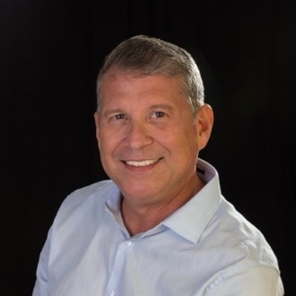

**Dr. Héctor R. Piñero Cádiz.**

👤 Ver biografía completa

Comunicador entendido en la producción para radio, televisión y video.
Su formación académica abarca la UPR-Humacao, Austin Peay State
University en Tennessee, Universidad del Sagrado Corazón y el Centro de
Estudios Avanzados de Puerto Rico y el Caribe. Colaboró en crear la
Primera Red de Audio Digital---Radio Web---de la UPR. Actualmente dirige
el Departamento de Comunicación de la UPR-H. Fue productor del programa
"Revista Universitaria" que se transmite por WALO 1240 AM y en el 105.1
FM. Ha publicado escritos profesionales en revistas especializadas y la
prensa del País y como invitado en programas de radio y televisión para
hablar sobre la radio en Puerto Rico. También ha realizado varias
presentaciones sobre comunicación, medios y educación en Puerto Rico, el
Caribe y Latinoamérica. Es autor de *Radio, Guerra y Censura: Los
orígenes de la radio en Puerto Rico hasta la Segunda Guerra Mundial*,
libro que recibió Mención de Honor por el PEN de Puerto Rico
Internacional.

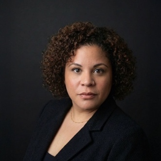

**Joselyn Ponce Barnés, MA**. Es estratega

👤 Ver biografía completa

en comunicaciones, relacionista licenciada y profesora universitaria en
Puerto Rico. Como parte de su desarrollo profesional ha fungido como
instructora en la UPR, donde también ha colaborado con la Rectoría como
Ayudante Especial en Comunicaciones, apoyando el desarrollo de mensajes
estratégicos y proyectos institucionales de alto impacto. Posee una
maestría en Relaciones Públicas de la Universidad del Sagrado Corazón y
un bachillerato en Comunicación Audiovisual de la UPR-Río Piedras. Ha
colaborado con instituciones académicas, organizaciones profesionales y
medios institucionales destacándose por su capacidad de transformar
contenido académico e institucional en narrativas claras, accesibles y
con impacto social. Su trabajo busca integrar una perspectiva
interdisciplinaria que une rigor académico, creatividad y sensibilidad
social. Realizó exitosamente la exposición fotográfica *Si Haití fuera
blanco*, un proyecto que invita a cuestionar las construcciones sociales
de la raza, la desigualdad y la justicia social a través de la imagen.

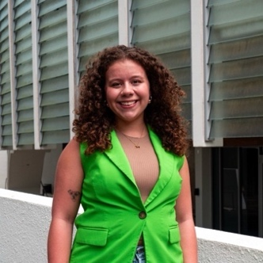

**Marina Reyes Huertas** es candidata a

👤 Ver biografía completa

graduación del Programa Graduado en Comunicación de la UPR-RP, donde
también completó su bachillerato en Información y Periodismo. Ha
estudiado los medios de comunicación y el papel del periodismo en la
construcción de narrativas sociales. Actualmente, se desempeña como
asistente de investigación en UPR Caribe Digital. Sus intereses
investigativos incluyen la prensa escrita y radial, con énfasis en la
cobertura de asuntos ambientales y sociales. Ha colaborado con diversos
medios de comunicación, entre ellos Radio Universidad, *Primera Hora*,
*El Nuevo Día*, PlateaPR y el Centro de Periodismo Investigativo. A
través de su trabajo, busca contribuir a una práctica periodística ética
y comprometida con el bienestar social.

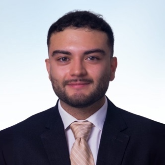

**Santiago Reyes (B.S, Florida State

👤 Ver biografía completa

University)** is a master's student in the Integrated Marketing
Communication program at Florida State University, where he is also
completing graduate certificates in Multicultural Marketing
Communication and Project Management. He holds dual bachelor's degrees
in Digital Media Production and Marketing, along with a minor in
Hispanic Marketing Communication. His research interests lie in
multicultural marketing and communication, particularly in understanding
how audiences respond to media, branding, and cultural representation.

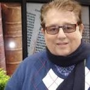

**Dr. Ángel Israel Rivera Ortiz,**

👤 Ver biografía completa

profesor retirado de Ciencia Política de la UPR-RP y la Universidad
Interamericana de Puerto Rico. Ha dictado cursos en la Universidad de
los Andes y en Lehman College de CUNY. Fue director de Ciencia Política
en UPR y presidió la junta de la revista *Caribbean Studies*. Ha
publicado artículos académicos o libros en Colombia, España, EE.UU.,
Inglaterra, Jamaica, México y Puerto Rico. Co-editó con Federico Subervi
Vélez la antología *Comunicación Política en Puerto Rico*; es autor de
*Puerto Rico ante los retos del siglo XXI* y *La gobernanaza democrática
en Caguas---una nueva forma de gobernar*. Incursionó por años con el
periódico *Claridad* y la revista *80grados*. Fue editor para *Ediciones
Nueva Aurora* y dirigió la producción y presentación de *Hilando Fino
Desde las Ciencias Sociales* por WRTU Radio UPR.

**Dr. Ojel Rodríguez Burgos.** Catedrático

👤 Ver biografía completa

Auxiliar y coordinador del programa de Estudios Internacionales y
Comunicación Global en la Universidad del Sagrado Corazón. Es
investigador visitante en el Instituto de Historia Intelectual de la
Universidad de St. Andrews y docente del programa de Maestría en
Relaciones Internacionales del Centro de Estudios Avanzados de Puerto
Rico y el Caribe. Realizó estudios de posgrado en Relaciones
Internacionales en King's College London, donde obtuvo la distinción
AKC, y en Pensamiento Político en University College London. Obtuvo su
doctorado en la Universidad de St. Andrews, con una tesis sobre la vida
y obra de Kenneth Minogue. Sus investigaciones se centran en la historia
intelectual, historia de las ideas, la ideología, la historia del
pensamiento político, teoría y política internacional. Ha publicado
artículos académicos, columnas de opinión y ensayos en medios como
*Forbes*, *Law & Liberty*, *Cosmos + Taxis, Journal History of European
Ideas, Society* y *Journal of Political Ideologies*.

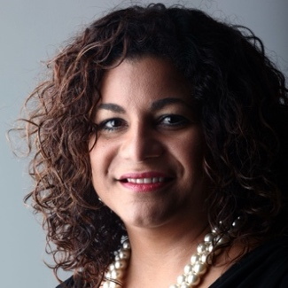

**Sandra Rodríguez Cotto, MA.** Es

👤 Ver biografía completa

periodista investigativa independiente, con sobre 30 años de experiencia
en Puerto Rico, EE.UU. y Latinoamérica. Especialista en análisis de
noticias y medios, columnista, bloguera, y conduce un programa radial
diario. Es autora de *Bitácora de una transmisión radial durante el
huracán María*, y de *En Blanco y Negro con Sandra*. También coautora
del libro *Para entender los medios de comunicación en Puerto Rico*, y
autora de ensayos en la antología *Crónicas de María, Aftershocks of the
disaster/Las réplicas del desastre**.*** Ha recibido sobre 40 premios en
periodismo, incluyendo dos veces el Premio Nacional de Literatura y
Periodismo Bolívar Pagán del Instituto de Literatura Puertorriqueña.
Posee un bachillerato de Rutgers University, y maestría de la Escuela de
Comunicación Pública de la Universidad de Puerto Rico.

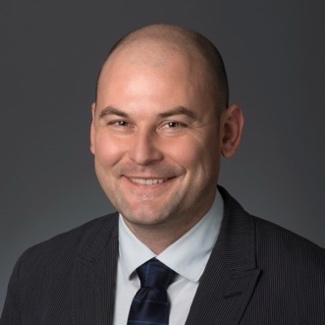

**Dr. Sergei A. Samoilenko**. Assistant

👤 Ver biografía completa

professor in the Department of Communication at George Mason University.
 His research focuses on issues of public character, reputation
management, subversive communication, and crisis management. He is a
co-founder of the Research Lab for Character Assassination and
Reputation Politics (CARP), an interdisciplinary research community
studying strategies and tactics of subversive communication and
reputation management: <https://carpresearchlab.org/>. He has coauthored
and co-edited several books, including *Character Assassination and
Reputation: Management Theory and Applications*, *Handbook of Social and
Political Conflict, *and* Handbook of Research on Deception, Fake News,
and Misinformation Online*.

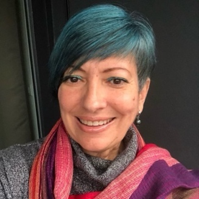

**Dra. Haydée Seijo Maldonado.**

👤 Ver biografía completa

Catedrática en la Facultad de Comunicación e Información de la
Universidad de Puerto Rico, recinto de Río Piedras, donde enseña los
cursos de investigación en comunicación, teorías de la comunicación y
seminarios graduados y subgraduados de variados temas en comunicación.
Su interés en la comunicación política le ha llevado a desarrollar una
extensa investigación en ese tema; su libro Television in *Children's
Political Development: A cultural and Sociological Analysis*, una
etnografía, es la más amplia de ellas. Investiga, además sobre la
interpretación y la política, las ciudadanías emergentes y los intentos
de nuevos órdenes mundiales, los medios y las culturas de guerra y paz y
los comunicadores no tradicionales en el movimiento de Paz para Vieques.
Después de experimentar los huracanes Irma y María, Seijo ha realizado
investigación sobre los desastres naturales y la comunicación. Su
investigación ha sido presentada en Estados Unidos, Latinoamérica y
Europa.

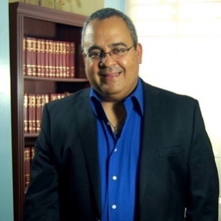

**Lcdo. Rafael Silva Almeyda.** Graduado

👤 Ver biografía completa

de Facultad de Ciencias Naturales con Bachillerato en Química y Juris
Doctor (Derecho) ambos grados de la UPR-RP. Graduado LLM Derecho y
Salud, DePaul University, Chicago; Graduado LLM Derecho de Propiedad
Intelectual, John Marshall Law School, ahora Chicago University Law
School, Chicago. Cuenta con 17 años de experiencia dictando cursos en la
Escuela de Comunicación (ahora parte de la Facultad de Comunicación e
Información) y en la Escuela de Derecho en la UPR-RP. Tiene treinta y
cinco años de experiencia en la práctica del derecho en Puerto Rico.
Miembro de la Comisión de Propiedad Intelectual del Colegio de Abogados
de Puerto Rico desde hace casi 20 años.

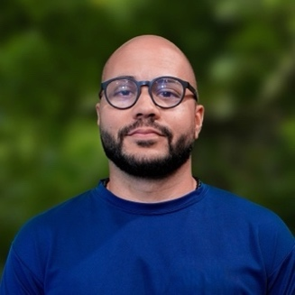

**Jean Carlos Suarez Rosa, MA**. Educador

👤 Ver biografía completa

con sólida formación académica y destacada trayectoria en la enseñanza
de historia. Posee grado de Especialista en Liderazgo Educativo de
George Washington University y Maestría en Artes en Historia de la
Universidad Interamericana, con tesis enfocada en la vida del obrero
puertorriqueño entre 1920 y 1938. Actualmente, cursa el Doctorado en
Ciencias Políticas en la Universidad de Barcelona, donde colabora con el
grupo de investigación Q-Dem. Su experiencia profesional abarca la
cátedra de historia y política en instituciones como la Universidad
Interamericana y TASIS Dorado. Además, ha sido creador de contenido
curricular de historia para SM Editorial y conferenciante, promoviendo
siempre el uso ético de la tecnología, pensamiento crítico y el análisis
de sistemas políticos.

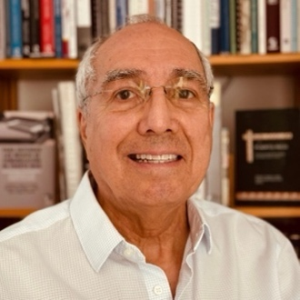

**Dr. Federico Subervi Vélez.** Colabora a

👤 Ver biografía completa

tiempo parcial con el Programa de Honor de la UPR-RP donde cursó su
bachillerato en Ciencias Sociales y maestría en Comunicación. Es
Associate/Fellow del programa de estudios latinoamericanos, caribeños e
ibéricos de la Universidad de Wisconsin-Madison, universidad de la cual
posee su doctorado. Desarrolló su carrera académica como profesor en
universidades en EE.UU. investigando, publicando y dictando cursos sobre
etnicidad, raza y comunicación. Ha ofrecido cursos y charlas en
universidades de Latinoamérica, EE.UU. y Europa. Sus libros más
recientes son, *Para Entender los Medios de Comunicación de Puerto Rico:
Periodismo en entornos coloniales y en tiempos de crisis* (con coautoría
de Sandra Rodríguez Cotto y Jairo Lugo Ocando), *Comunicación Política
en Puerto Rico*: *Primera antología de ensayos, investigaciones y
críticas* (coeditado con Ángel Israel Rivera Ortiz) y el *Oxford
Encyclopedia of race, ethnicity and communication* (coeditor en jefe con
Sudeshna Roy).

**Dra. Mayra Vélez-Serrano**. Profesora

👤 Ver biografía completa

Asociada del Departamento de Ciencia Política de la UPR-RP, donde se
desempeña como directora del departamento. Obtuvo su Bachillerato en
Ciencias Políticas en la UPR-RP y completó su doctorado en Ciencias
Políticas en la Universidad Estatal de Nueva York en Buffalo. Es
codirectora del Puerto Rico Public Opinion Lab, una iniciativa para
fortalecer la infraestructura de investigación y el estudio de la
opinión pública en Puerto Rico. También es codirectora del proyecto REU
Site: US Political Economy and Mobilization, apoyando la formación de
estudiantes en investigación social y política. Además, es anfitriona
del programa radial *Hilando Fino desde las Ciencias Sociales* en Radio
Universidad (89.7 FM), desde donde contribuye al análisis de asuntos
políticos y sociales. Investiga temas de ideología política, populismo y
autoritarismo, política partidista, movilización y comunicación política
en Puerto Rico. Su trabajo ha sido publicado en revistas académicas y ha
sido apoyado por múltiples subvenciones de la National Science
Foundation.

**Dra. María V. Vera Hernández** cuenta

👤 Ver biografía completa

con un doctorado en Educación y Comunicación Social de la Universidad de
Málaga, una maestría en Redacción para los Medios de la Universidad del
Sagrado Corazón y un bachillerato en Comunicación de la UPR-RP. Ha
trabajado como periodista desde el 1996, tanto en medios electrónicos
como impresos. Ha tenido a su cargo la cobertura de importantes fuentes
noticiosas, entre ellas la Asamblea Legislativa y La Fortaleza. En 2009
ingresó a la academia como profesora de Periodismo y actualmente es la
Decana de la Escuela de Comunicación Ferré Rangel de la Universidad del
Sagrado Corazón.

**Dr. Kenton Wilkinson**. Profesor Regente

👤 Ver biografía completa

y director del Instituto Thomas Jay Harris para la Comunicación Hispana
e Internacional en la Facultad de Medios y Comunicación en Texas Tech
University. Iinvestiga la comunicación internacional, los medios
dirigidos a hispanas en los EE.UU., la diferencia lingüística en medios
electrónicos, y la comunicación para la salud. Es autor de
*Spanish-Language Television in the United States: Fifty Years of
Development*. Actualmente está desarrollando un proyecto sobre la
historia de la diferencia lingüística en medios electrónicos, y
colaborando con proyectos de investigación enfocados sobre el idioma e
la identidad entre los latinos del oeste de Texas y dos capítulos sobre
los medios de servicio público en América Latina y el Caribe.

---

  <a href="{{ site.baseurl }}/resumenes" class="nav-button prev">← Resúmenes</a>
  <a href="{{ site.baseurl }}/index" class="nav-button home">🏠 Inicio</a>
  <a href="{{ site.baseurl }}/recursos" class="nav-button next">Recursos bibliográficos →</a>

